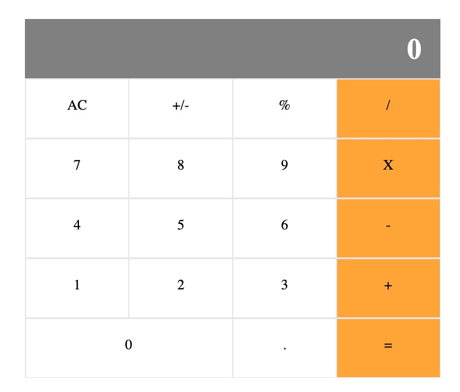

# React Calculator

The aim of this project was to build a simple calculator app using React.

  

## Live Demo

Click [here](https://kerron-king-calculator.herokuapp.com/) to see a live demo.

## Built With

This app was built using the following:
- React
- CSS3
- HTML5

## Getting Started

* Open the terminal and clone the repo

## Contributing

Contributions, issues and feature requests are welcome!

## Show your support

Feel free to drop a :+1: to show your support. It'd be greatly appreciated it :pray:

## Author

:bust_in_silhouette: Kerron King

Github: [@KerronKing](https://github.com/KerronKing)
Twitter: [@KerronTriniDev](https://twitter.com/kerrontrinidev)
Linkedin: [Kerron King](linkedin.com/in/kerron-king-53912516a)

## License :memo:

This project is MIT licensed.
